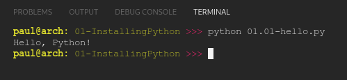

# PY4E - 01 Installing Python

## Resources

- #### Videos
  - [Windows Setup](https://youtu.be/uZbaYeYGYRQ)
  - [Mac Setup](https://youtu.be/aIcLCww_kQM)
- #### Images & Text
  - [Windows Setup](https://www.py4e.com/software-win.php)
  - [Mac Setup](https://www.py4e.com/software-mac.php)

 

---

## Peer Review

### Install Python and a programming text editor and write a program that prints one line other than 'hello world', then take two screen shots and upload them

I will be alternating between working on Linux and Windows 10. This will require python is working in both environments.

**CODE**

[01.01-hello.py](01.01-hello.py) tests python is properly installed and running by printing a string to console.

**LINUX**

Python 3.10.4 already installed. The result was as follows:

**WIN 10**

python-3.10.4-amd64.exe downloaded from [python.org](http://www.python.org/downloads/release/python-3104/) and installed. Results as follows:

**RESULTS**

 

---
