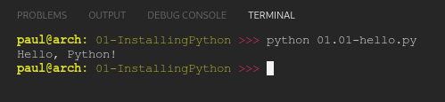
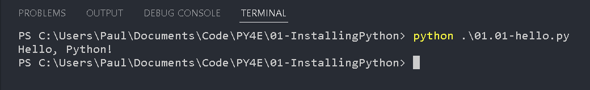

# PY4E

## 01 Installing Python

I will be alternating between working on Linux and Windows 10. This will require python is working in both environments.

### Code

[01.01-hello.py](01.01-hello.py) tests python is properly installed and running by printing a string to console.

### Linux

Python 3.10.4 already installed. The result was as follows: 

### Windows 10

python-3.10.4-amd64.exe downloaded from [python.org](www.python.org/downloads/release/python-3104/) and installed. Results as follows:

### Results

**TBA**