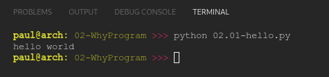

# PY4E 02 - Why Program

## Resources

- ### Videos
  - [Part 1](https://youtu.be/fvhNadKjE8g)
  - [Part 2](https://youtu.be/VQZTZsXk8sA)
  - [Part 3](https://youtu.be/LLzFNlCjTSo)
  - [Part 4](https://youtu.be/gsry2SYOFCw)
  - [Writing 'hello world' in the Autograder](https://youtu.be/aDwb41EMEQQ)
- ### Images & Text
  - [Slides](../Resources/Slides/Pythonlearn-01-Intro.pptx)
  - [Chapter One html](https://www.py4e.com/html3/01-intro)

<br>

---

## Autograder

### Write a program that uses a print statement to say 'hello world' as shown in 'Desired Output'.

**CODE**

see [02.01-hello.py](02.01-hello.py)

**RESULT**



<br>

---

## Quiz

**QUESTIONS**

### 1. What is the best way to think about a "Syntax Error" while programming?

   - The computer did not understand the statement that you entered

### 2. What will the following program print out:

```python
>>> x = 15
>>> x = x + 5
>>> print(x)
```

   - 20

### 3. Python scripts (files) have names that end with:

   - .py

### 4. Which of these words is a reserved word in Python?

  - while

### 5. Which of these words are reserved words in Python?

  - break
  - if

### 6. What is the proper way to say “good-bye” to Python?

  - quit()

### 7. Which of the parts of a computer actually executes the program instructions?

  - Central Processing Unit

### 8. What is "code" in the context of this course?

  - A sequence of instructions in a programming language

### 9. A USB memory stick is an example of which of the following components of computer architecture?

  - Secondary Memory

### 10.  What is the best way to think about a "Syntax Error" while programming?

  - The computer did not understand the statement that you entered

**RESULT**


<br>

---