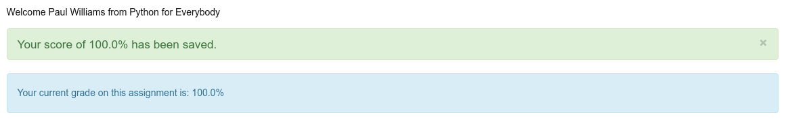

# PY4E 03 - Variables, Expressions and Statements

## Resources

- ### Videos
  - [Part 1](https://youtu.be/7KHdV6FSpo8)
  - [Part 2](https://youtu.be/kefrGMAglGs)
  - [Worked Exercise 2.2](https://youtu.be/_b-nVJrl02M)
  - [Worked Exercise 2.3](https://youtu.be/DVmspDooG2c)
- ### Images & Text
  - [Slides](../Resources/Slides/Pythonlearn-02-Expressions.pptx)
  - [Chapter Two html](https://www.py4e.com/html3/02-variables)

<br>

---

## Autograder

### Write a program to prompt the user for hours and rate per hour using input to compute gross pay. Use 35 hours and a rate of 2.75 per hour to test the program (the pay should be 96.25). You should use input to read a string and float() to convert the string to a number. Do not worry about error checking or bad user data.

**CODE**

see [03.01-rate.py](03.01-rate.py)

**RESULT**


<br>

---

## Quiz

**QUESTIONS**

### 1. In the following code, what is "98.6"?

```python
print(98.6)
```

  - A constant

### 2. Which of the following is a comment in Python?

  - `# This is a test`

### 3. What does the following code print out?

```python
print("123" + "abc")
```

  - 123abc

### 4. In the following code what is "x"?

```python
x = 42
```

  - A variable

### 5. Which of the following is a bad Python variable name?

  - 23spam

### 6. Which of the following variables is the "most mnemonic"?

  - hours

### 7. Which of the following is not a Python reserved word?

  - speed

### 8. Which of the following is not a Python reserved word?

  - iterate

### 9. Assume the variable x has been initialized to an integer value (e.g., x = 3). What does the following statement do?

```python
x = x + 2
```

  - Retrieve the current value for x, add two to it and put the sum back into x

### 10. Which of the following elements of a mathematical expression in Python is evaluated first?

  - Parentheses ( )

### 11. What is the value of the following expression

```python
42 % 10
```

  - 2

### 12. What will be the value of x after the following statement executes:

```python
x = 1 + 2 * 3 - 8 / 4
```

  - 5.0

### 13. What will be the value of x when the following statement is executed:

```python
x = int(98.6)
```

  - 98

### 14. What does the Python input() function do?

  - Pause the program and read data from the user

**RESULT**



<br>

---