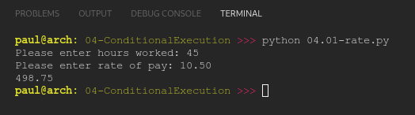

# PY4E 04 - Conditional Execution

## Resources

- ### Videos
  - [Part 1](https://youtu.be/2aA3VBdcl6A)
  - [Part 2](https://youtu.be/OczkNrHPBps)
  - [Worked Exercise 2.2](https://youtu.be/oUMQbZ4SBuM)
  - [Worked Exercise 2.3](https://youtu.be/-iUA4cCKRlM)
- ### Images & Text
  - [Slides](../Resources/Slides/Pythonlearn-03-Conditional.pptx)
  - [Chapter One html](https://www.py4e.com/html3/03-conditional)

<br>

---

## Autograder - Exercise 04.01

### Write a program to prompt the user for hours and rate per hour using input to compute gross pay. Pay the hourly rate for the hours up to 40 and 1.5 times the hourly rate for all hours worked above 40 hours. Use 45 hours and a rate of 10.50 per hour to test the program (the output should be 498.75). You should use input to read a string and float() to convert the string to a number. Do not worry about error checking the user input - assume the user types numbers properly.

**OUTPUT**

`498.75`

**CODE**

see [04.01-rate.py](04.01-rate.py)

**RESULT**



<br>

---

## Autograder - Exercise 04.02

### Write a program to prompt for a score between 0.0 and 1.0. If the score is out of range, print an error. If the score is between 0.0 and 1.0, print a grade using the following table:
| Score Grade |
|:-----------:|
| >= 0.9 A    |
| >= 0.8 B    |
| >= 0.7 C    |
| >= 0.6 D    |
| < 0.6 F     |
### If the user enters a value out of range, print a suitable error message and exit. For the test, enter a score of 0.85.

**OUTPUT**

`B`

**CODE**

see [04.02-grade.py](04.02-grade.py)

**RESULT**


<br>

---

## Quiz

**QUESTIONS**

### 1. What do we do to a Python statement that is immediately after an if statement to indicate that the statement is to be executed only when the if statement is true?

  - Indent the line below the if statement

### 2. Which of these operators is not a comparison / logical operator?

  - =

### 3. What is true about the following code segment:

```python
if  x == 5 :
    print('Is 5')
    print('Is Still 5')
    print('Third 5')
```

  - Depending on the value of x, either all three of the print statements will execute or none of the statements will execute

### 4. When you have multiple lines in an if block, how do you indicate the end of the if block?

  - You de-indent the next line past the if block to the same level of indent as the original if statement

### 5. You look at the following text:

```python
if x == 6 :
    print('Is 6')
    print('Is Still 6')
    print('Third 6')
```

### It looks perfect but Python is giving you an 'Indentation Error' on the second print statement. What is the most likely reason?

  - You have mixed tabs and spaces in the file

### 6. What is the Python reserved word that we use in two-way if tests to indicate the block of code that is to be executed if the logical test is false?

  - else

### 7. What will the following code print out?

```python
x = 0
if x < 2 :
    print('Small')
elif x < 10 :
    print('Medium')
else :
    print('LARGE')
print('All done')
```

  - Small All done

### 8. For the following code what value of 'x' will cause 'Something else' to print out?

```python
if x < 2 :
    print('Below 2')
elif x >= 2 :
     print('Two or more')
else :
    print('Something else')
```

  - This code will never print 'Something else' regardless of the value for 'x'

### 9. In the following code (numbers added) - which will be the last line to execute successfully?

```python
(1)   astr = 'Hello Bob'
(2)   istr = int(astr)
(3)   print('First', istr)
(4)   astr = '123'
(5)   istr = int(astr)
(6)   print('Second', istr)
```

  - 1

### 10. For the following code what will the value be for istr after this code executes?

```python
astr = 'Hello Bob'
istr = 0
try:
    istr = int(astr)
except:
    istr = -1
```

  - -1

**RESULT**


<br>

---