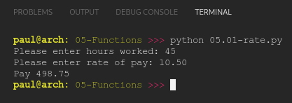
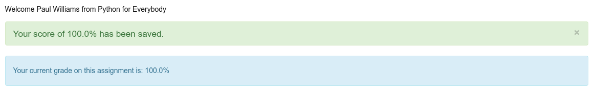

# PY4E 05 - Functions
## Resources

- ### Videos
  - [Part 1](https://youtu.be/5Kzw-0-DQAk)
  - [Part 2](https://youtu.be/AJVNYRqn8kM)
  - [Worked Exercise 4.6](https://youtu.be/l93PhBUJ_S0)
- ### Images & Text
  - [Slides](../Resources/Slides/Pythonlearn-04-Functions.pptx)
  - [Chapter One html](https://www.py4e.com/html3/04-functions)

<br>

---

## Autograder - Exercise 05.01

### Write a program to prompt the user for hours and rate per hour using input to compute gross pay. Pay should be the normal rate for hours up to 40 and time-and-a-half for the hourly rate for all hours worked above 40 hours. Put the logic to do the computation of pay in a function called computepay() and use the function to do the computation. The function should return a value. Use 45 hours and a rate of 10.50 per hour to test the program (the pay should be 498.75). You should use input to read a string and float() to convert the string to a number. Do not worry about error checking the user input unless you want to - you can assume the user types numbers properly. Do not name your variable sum or use the sum() function.

**OUTPUT**

`Pay 498.75`

**CODE**

see [05.01-rate.py](05.01-rate.py)

**RESULT**



<br>

---

## Quiz

**QUESTIONS**

### 1.  Which Python keyword indicates the start of a function definition?

  - def

### 2. In Python, how do you indicate the end of the block of code that makes up the function?

  - You de-indent a line of code to the same indent level as the def keyword

### 3. In Python what is the input() feature best described as?

  - A built-in function

### 4. What does the following code print out?

```python
def thing():
    print('Hello')
 
print('There')
```

- There

### 5. In the following Python code, which of the following is an "argument" to a function?

```python
x = 'banana'
y = max(x)
print(y)
```
  - x

### 6. What will the following Python code print out?

```python
def func(x) :
    print(x)
 
func(10)
func(20)
```

  - 1020

### 7. Which line of the following Python program will never execute?

```python
def stuff():
    print('Hello')
    return
    print('World')
 
stuff()
```

  - print ('World')

### 8. What will the following Python program print out?

```python
def greet(lang):
    if lang == 'es':
        return 'Hola'
    elif lang == 'fr':
        return 'Bonjour'
    else:
        return 'Hello'
 
print(greet('fr'),'Michael')
```
  - Bonjour Michael
  
### 9. What is the most important benefit of writing your own functions?

  - Avoiding writing the same non-trivial code more than once in your program

**RESULT**



<br>

---