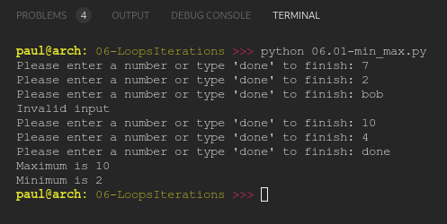

# PY4E 06 - Loops and Iterations
## Resources

- ### Videos
  - [Part 1](https://youtu.be/FzpurxjwmsM)
  - [Part 2](https://youtu.be/5QDrj5ogPYc)
  - [Part 3](https://youtu.be/xsavQp8hd78)
  - [Part 4](https://youtu.be/yjlMMwf9Y5I)
  - [Worked Exercise 5.1](https://youtu.be/R2GrfqRofZc)
- ### Images & Text
  - [Slides](../Resources/Slides/Pythonlearn-05-Iterations.pptx)
  - [Chapter Five html](https://www.py4e.com/html3/05-iterations)

<br>

---

## Autograder - Exercise 05.02

### Write a program that repeatedly prompts a user for integer numbers until the user enters 'done'. Once 'done' is entered, print out the largest and smallest of the numbers. If the user enters anything other than a valid number catch it with a try/except and put out an appropriate message and ignore the number. Enter 7, 2, bob, 10, and 4 and match the output below.

**OUTPUT**

```
Invalid input
Maximum is 10
Minimum is 2
```

**CODE**

see [06.01-min_max.py](06.01-min_max.py)

**RESULT**



*NOTE: autograder does not print input("str") to console*

<br>

---

## Quiz

**QUESTIONS**

### 1. What is wrong with this Python loop:

```python
n = 5
while n > 0 :
    print(n)
print('All done')
```

  - This loop will run forever

### 2. What does the break statement do?

  - Exits the currently executing loop

### 3. What does the continue statement do?

  - Jumps to the "top" of the loop and starts the next iteration

### 4. What does the following Python program print out?

```python
tot = 0
for i in [5, 4, 3, 2, 1] :
    tot = tot + 1
print(tot)
```

  - 5

### 5. What is the iteration variable in the following Python code:

```python
friends = ['Joseph', 'Glenn', 'Sally']
for friend in friends :
     print('Happy New Year:',  friend)
print('Done!')
```

  - friend

### 6. What is a good description of the following bit of Python code?

```python
zork = 0
for thing in [9, 41, 12, 3, 74, 15] :
    zork = zork + thing
print('After', zork)
```

  - Sum all the elements of a list

### 7. What will the following code print out?

```python
smallest_so_far = -1
for the_num in [9, 41, 12, 3, 74, 15] :
   if the_num < smallest_so_far :
      smallest_so_far = the_num
print(smallest_so_far)
```

  - -1

### 8. What is a good statement to describe the is operator as used in the following if statement:

```python
if smallest is None :
     smallest = value
```

  - matches both type and value

### 9. Which reserved word indicates the start of an "indefinite" loop in Python?

  - while

### 10. How many times will the body of the following loop be executed?

```python
n = 0
while n > 0 :
    print('Lather')
    print('Rinse')
print('Dry off!')
```
  - 0

**RESULT**


<br>

---