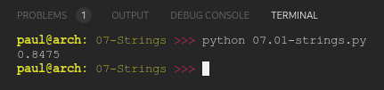

# PY4E 07 - Strings
## Resources

- ### Videos
  - [Part 1](https://youtu.be/dr98iM4app8)
  - [Part 2](https://youtu.be/bIFpJ-qZ3Cc)
  - [Worked Exercise 6.5](https://youtu.be/BGTxwsDI9KY)
- ### Images & Text
  - [Slides](../Resources/Slides/Pythonlearn-06-Strings.pptx)
  - [Chapter Five html](https://www.py4e.com/html3/06-strings)

<br>

---

## Autograder - Exercise 07.01

### Write code using find() and string slicing (see section 6.10) to extract the number at the end of the line below. Convert the extracted value to a floating point number and print it out.

**LINE**

`text = "X-DSPAM-Confidence:    0.8475"`

**OUTPUT**

`0.8475`

**CODE**

see [07.01-strings.py](07.01-strings.py)

**RESULT**



<br>

---

## Quiz

**QUESTIONS**

### 1. What does the following Python Program print out?

```python
str1 = "Hello"
str2 = 'there'
bob = str1 + str2
print(bob)
```

  - Hellothere

### 2. What does the following Python program print out?

```python
x = '40'
y = int(x) + 2
print(y)
```

  - 42

### 3. How would you use the index operator [] to print out the letter q from the following string?

`x = 'From marquard@uct.ac.za'`

- print(x[8])

### 4. How would you use string slicing [:] to print out 'uct' from the following string?

`x = 'From marquard@uct.ac.za'`

  - print(x[14:17])

### 5. What is the iteration variable in the following Python code?

```python
for letter in 'banana' :
    print(letter)
```

  - letter

### 6. What does the following Python code print out?

`print(len('banana')*7)`

  - 42

### 7. How would you print out the following variable in all upper case in Python?

`greet = 'Hello Bob'`

  - print(greet.upper())

### 8. Which of the following is not a valid string method in Python?

  - shout()

### 9. What will the following Python code print out?

```python
data = 'From stephen.marquard@uct.ac.za Sat Jan  5 09:14:16 2008'
pos = data.find('.')
print(data[pos:pos+3])
```

  - .ma


### 10. Which of the following string methods removes whitespace from both the beginning and end of a string?

  - strip()

**RESULT**


<br>

---