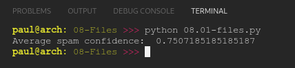

# PY4E 08 - Files
## Resources

- ### Videos
  - [Part 1](https://youtu.be/9KJ-XeQ6ZlI)
  - [Part 2](https://youtu.be/0t4rvnySKR4)
  - [Worked Exercise 7.1](https://youtu.be/MHZ4KnFZ7Y0)
- ### Images & Text
  - [Slides](../Resources/Slides/Pythonlearn-07-Files.pptx)
  - [Chapter Five html](https://www.py4e.com/html3/07-files)

<br>

---

## Autograder - Exercise 08.01

### Write a program that prompts for a file name, then opens that file and reads through the file, looking for lines of the form:

`X-DSPAM-Confidence:    0.8475`

### Count these lines and extract the floating point values from each of the lines and compute the average of those values and produce an output as shown below. Do not use the sum() function or a variable named sum in your solution.

**OUTPUT**

`Average spam confidence: 0.7507185185185187`

**CODE**

see [08.01-files.py](08.01-files.py)

**RESULT**



<br>

---

## Quiz

**QUESTIONS**

### 1. Given the architecture and terminology we introduced in Chapter 1, where are files stored?

  - Secondary memory

### 2. What is stored in a "file handle" that is returned from a successful open() call?

  - The handle is a connection to the file's data

### 3. What do we use the second parameter of the open() call to indicate?

  - Whether we want to read data from the file or write data to the file

### 4.What Python function would you use if you wanted to prompt the user for a file name to open?

  - input()

### 5. What is the purpose of the newline character in text files?

  - It indicates the end of one line of text and the beginning of another line of text

### 6. If we open a file as follows:

`xfile = open('mbox.txt')`

### What statement would we use to read the file one line at a time?

  - for line in xfile:

### 7. What is the purpose of the following Python code?

```python
fhand = open('mbox.txt')
x = 0
for line in fhand:
       x = x + 1
print(x)
```

  - Count the lines in the file 'mbox.txt'

### 8. If you write a Python program to read a text file and you see extra blank lines in the output that are not present in the file input as shown below, what Python string function will likely solve the problem?

```
From: stephen.marquard@uct.ac.za
 
From: louis@media.berkeley.edu
 
From: zqian@umich.edu
 
From: rjlowe@iupui.edu
```

  - rstrip()

### 9.  The following code sequence fails with a traceback when the user enters a file that does not exist. How would you avoid the traceback and make it so you could print out your own error message when a bad file name was entered?

```python
fname = input('Enter the file name: ')
fhand = open(fname)
```

  - try / except

### 10. What does the following Python code do?

```python
fhand = open('mbox-short.txt')
inp = fhand.read()
```

  - Reads the entire file into the variable inp as a string

**RESULT**


<br>

---