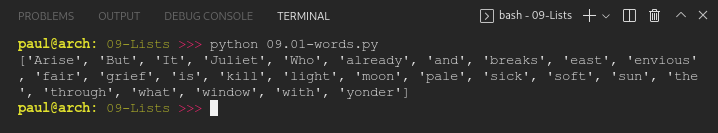
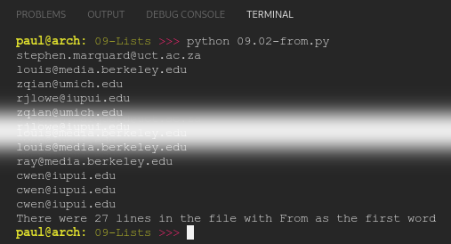

# PY4E 09 - Lists
## Resources

- ### Videos
  - [Part 1](https://youtu.be/ljExWqnWQvo)
  - [Part 2](https://youtu.be/bV1FQUBIApM)
  - [Part 3](https://youtu.be/bV1FQUBIApM)
- ### Images & Text
  - [Slides](../Resources/Slides/Pythonlearn-07-Files.pptx)
  - [Chapter Five html](https://www.py4e.com/html3/08-lists)

<br>

---

## Autograder - Exercise 09.01

### Open the file romeo.txt and read it line by line. For each line, split the line into a list of words using the split() method. The program should build a list of words. For each word on each line check to see if the word is already in the list and if not append it to the list. When the program completes, sort and print the resulting words in alphabetical order.

**OUTPUT**

`['Arise', 'But', 'It', 'Juliet', 'Who', 'already', 'and', 'breaks', 'east', 'envious', 'fair', 'grief', 'is', 'kill', 'light', 'moon', 'pale', 'sick', 'soft', 'sun', 'the', 'through', 'what', 'window', 'with', 'yonder']`

**CODE**

see [09.01-words.py](09.01-words.py)

**RESULT**



<br>

---

## Autograder - Exercise 09.02

### Open the file mbox-short.txt and read it line by line. When you find a line that starts with 'From ' like the following line:

`From stephen.marquard@uct.ac.za Sat Jan  5 09:14:16 2008`

### You will parse the From line using split() and print out the second word in the line (i.e. the entire address of the person who sent the message). Then print out a count at the end.

**OUTPUT**

```
stephen.marquard@uct.ac.za
louis@media.berkeley.edu
[...]
cwen@iupui.edu
cwen@iupui.edu
There were 27 lines in the file with From as the first word
```

**CODE**

see [09.02-from.py](09.02-from.py)

**RESULT**



<br>

---

## Quiz

**QUESTIONS**

### 1. How are "collection" variables different from normal variables?

  - Collection variables can store multiple values in a single variable

### 2. What are the Python keywords used to construct a loop to iterate through a list?

  - for / in

### 3. For the following list, how would you print out 'Sally'?

`friends = [ 'Joseph', 'Glenn', 'Sally' ]`

  - print(friends[2])

### 4. What would the following Python code print out?

```
fruit = 'Banana'
fruit[0] = 'b'
print(fruit)
```

  - Nothing would print - the program fails with a traceback error

### 5. Which of the following Python statements would print out the length of a list stored in the variable data?

  - print(len(data))

### 6. What type of data is produced when you call the range() function?

  - A list of integers

### 7. What does the following Python code print out?

```python
a = [1, 2, 3]
b = [4, 5, 6]
c = a + b
print(len(c))
```

 6

### 8. Which of the following slicing operations will produce the list [12, 3]?

`t = [9, 41, 12, 3, 74, 15]`

- t[2:4]

### 9. What list method adds a new item to the end of an existing list?

  - append()

### 10. What will the following Python code print out?

```python
friends = [ 'Joseph', 'Glenn', 'Sally' ]
friends.sort()
print(friends[0])
```

  - Glenn

**RESULT**


<br>

---