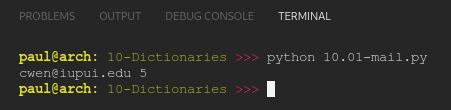

# PY4E 10 - Dictionaries
## Resources

- ### Videos
  - [Part 1](https://youtu.be/yDDRMb-1cxI)
  - [Part 2](https://youtu.be/LRSIuH94XM4)
  - [Part 3](https://youtu.be/ZDjiFB1Ib84)
- ### Images & Text
  - [Slides](../Resources/Slides/Pythonlearn-09-Dictionaries.pptx)
  - [Chapter Five html](https://www.py4e.com/html3/09-dictionaries)

<br>

---

## Autograder - Exercise 10.01

### Write a program to read through the mbox-short.txt and figure out who has sent the greatest number of mail messages. The program looks for 'From ' lines and takes the second word of those lines as the person who sent the mail. The program creates a Python dictionary that maps the sender's mail address to a count of the number of times they appear in the file. After the dictionary is produced, the program reads through the dictionary using a maximum loop to find the most prolific committer.

**OUTPUT**

`cwen@iupui.edu 5`

**CODE**

see [10.01-mail.py](10.01-mail.py)

**RESULT**



<br>

---

## Quiz

**QUESTIONS**

### 1. How are Python dictionaries different from Python lists?

  - Python lists maintain order and dictionaries do not maintain order

### 2. How are Python dictionaries different from Python lists?

  - Python lists are indexed using integers and dictionaries can use strings as indexes

### 3. What is a term commonly used to describe the Python dictionary feature in other programming languages?

  - Associative arrays

### 4. What would the following Python code print out?

```python
stuff = dict()
print(stuff['candy'])
```

  - The program would fail with a traceback

### 5. What would the following Python code print out?

```python
 stuff = dict()
 print(stuff.get('candy',-1))
 ```

     -1

### 6. When you add items to a dictionary they remain in the order in which you added them.

  - False

### 7. What is a common use of Python dictionaries in a program?

  - Building a histogram counting the occurrences of various strings in a file

### 8.Which of the following lines of Python is equivalent to the following sequence of statements assuming that counts is a dictionary?
```python
if key in counts:
    counts[key] = counts[key] + 1
else:
    counts[key] = 1
```

  - counts[key] = counts.get(key,0) + 1

### 9. In the following Python, what does the for loop iterate through?

```python
x = dict()
...
for y in x :
     ...
```

  - It loops through the keys in the dictionary

### 10. Which method in a dictionary object gives you a list of the values in the dictionary?

- values()

### 11. What is the purpose of the second parameter of the get() method for Python dictionaries?

  - To provide a default value if the key is not found

**RESULT**


<br>

---