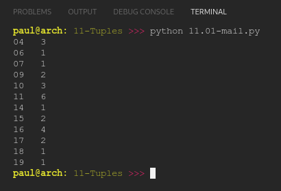

# PY4E 11 - Tuples
## Resources

- ### Videos
  - [Part 1](https://youtu.be/CaVhM65wD6g)
  - [Part 2](https://youtu.be/FdUdA6o0Ij0)
- ### Images & Text
  - [Slides](../Resources/Slides/Pythonlearn-10-Tuples.pptx)
  - [Chapter Five html](https://www.py4e.com/html3/10-tuples)

<br>

---

## Autograder - Exercise 11.01

### Write a program to read through the mbox-short.txt and figure out the distribution by hour of the day for each of the messages. You can pull the hour out from the 'From ' line by finding the time and then splitting the string a second time using a colon.
`From stephen.marquard@uct.ac.za Sat Jan  5 09:14:16 2008`
### Once you have accumulated the counts for each hour, print out the counts, sorted by hour as shown below.

**OUTPUT**

```
04 3
06 1
07 1
09 2
10 3
11 6
14 1
15 2
16 4
17 2
18 1
19 1
```

**CODE**

see [11.01-mail.py](11.01-mail.py)

**RESULT**



<br>

---

## Quiz

**QUESTIONS**

### 1. What is the difference between a Python tuple and Python list?

  - Lists are mutable and tuples are not mutable

### 2. Which of the following methods are available for both Python lists and Python tuples?

  - index()

### 3. What will end up in the variable y after this code is executed?

`x , y = 3, 4`

  - 4


### 4. In the following Python code, what will end up in the variable y?

```python
x = { 'chuck' : 1 , 'fred' : 42, 'jan': 100}
y = x.items()
```

- A list of tuples

### 5. Which of the following tuples is greater than x in the following Python sequence?

```python
x = (5, 1, 3)
if ??? > x :
    ...
```

  - (6, 0, 0)

### 6. What does the following Python code accomplish, assuming the c is a non-empty dictionary?

```python
tmp = list()
for k, v in c.items() :
    tmp.append( (v, k) )
```

  - It creates a list of tuples where each tuple is a value, key pair

### 7. If the variable data is a Python list, how do we sort it in reverse order?

  - data.sort(reverse=True)


### 8. Using the following tuple, how would you print 'Wed'?

`days = ('Mon', 'Tue', 'Wed', 'Thu', 'Fri', 'Sat', 'Sun')`

- print(days[2])

### 9. In the following Python loop, why are there two iteration variables (k and v)?

```python
c = {'a':10, 'b':1, 'c':22}
for k, v in c.items() :
    ...
```

- Because the items() method in dictionaries returns a list of tuples


### 10. Given that Python lists and Python tuples are quite similar - when might you prefer to use a tuple over a list?

  - For a temporary variable that you will use and discard without modifying

**RESULT**


<br>

---